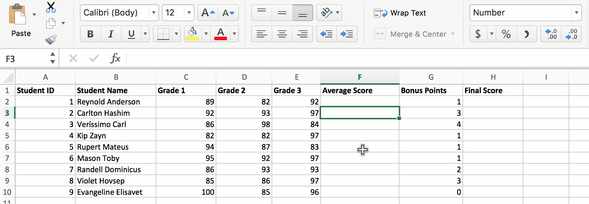
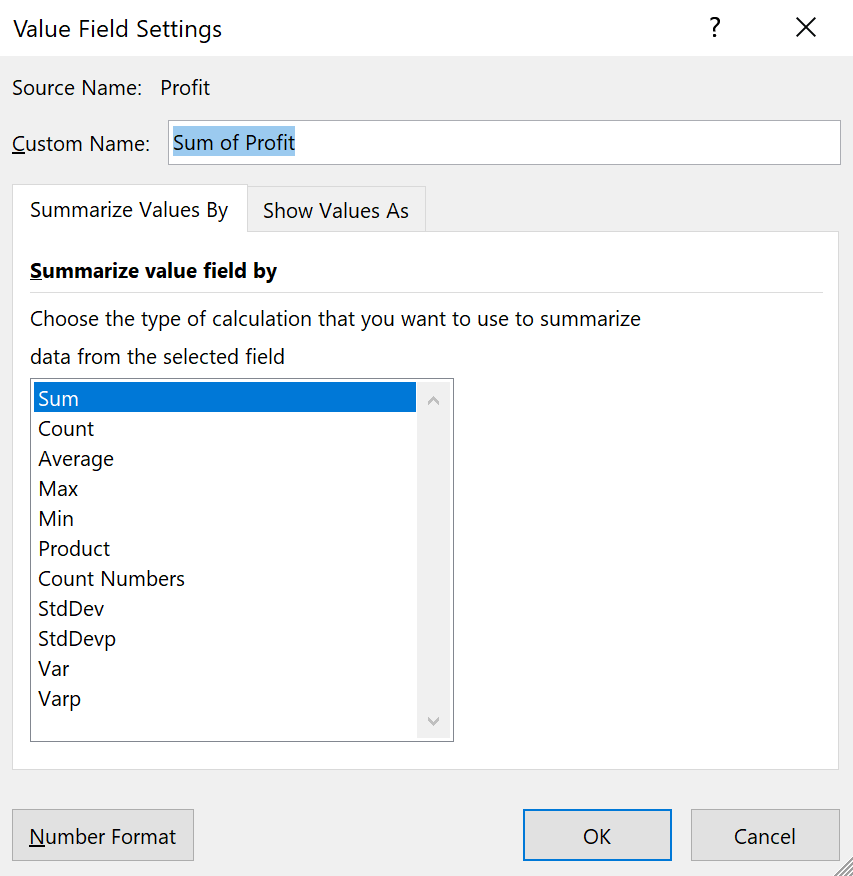
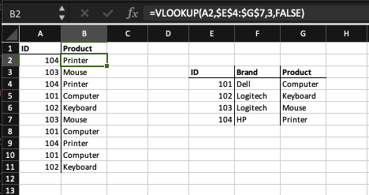
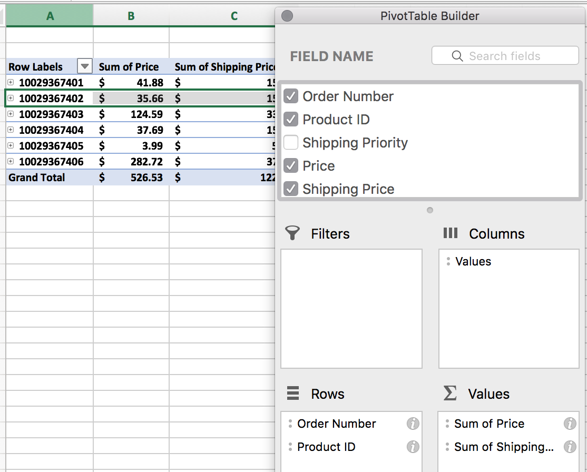

# Module 1 Class 1: Introductions and Getting Started

## Overview

In today's class, the students will get to know the structure of the live lessons. They’ll introduce themselves and talk about their backgrounds, as well as the professional journey that brought them to this course. In addition, the students will make sure that their computers are set up for Excel.

## Learning Objectives

By the end of class, students will be able to:
 
* Navigate Excel
* Apply formatting and use functions 
* Demonstrate the value of Pivot Tables and the steps for their utilization
* Create charts that contain filtered data
* Demonstrate the utilization of VLOOKUP and HLOOKUP.

- - -

## Instructor Notes

* The activities in this class will complement Lessons **1.0.1 Excelling with Excel** through **1.4.2 VLOOKUP**. The students will benefit from these activities if they’ve progressed through these lessons, which cover the following concepts, techniques, and tasks: 

    * Downloading and installing Excel
    * Downloading the `StarterBook.xlsx` for the module.
    * Filtering, formatting, and freezing specific columns and rows in Excel. 
    * Adding conditional formatting to columns
    * Finding averages
    * Debugging errors
    * Using pivot tables and creating charts
    * Filtering a data set using `VLOOKUP()`.

## Slides

[Excel Day 1 slideshow](https://docs.google.com/presentation/d/1dcoTmHmK9DDlcQnzfX2FZQjVqb26DVB23x6LbsqPbuY/edit#slide=id.ga41c6b4aff_0_0)

## Student Resources

If students were unable to download today's [activity resources](https://2u-data-curriculum-team.s3.amazonaws.com/data-viz-online-lesson-plans/01-Lessons/1-1-Student-Resources.zip) from Canvas, please share them with the students.  

- - - 

## Before Class

### 0. Office Hours

| Activity Time: 0:30       |  Elapsed Time:     -0:30  |
|---------------------------|---------------------------|

  
<strong> 📣 0.1 Instructor Do: Office Hours</strong>

* Before you begin class, hold office hours. Office hours should be driven by students. Encourage students to take full advantage of office hours by reminding them that this is their time to ask questions and get assistance from instructional staff as they learn new concepts.

* Expect that students may ask for assistance. For example: 

  * Further review on a particular subject
  * Debugging assistance
  * Help with computer issues
  * Guidance with a particular tool

- - - 

## During Class 

### 1. Getting Started

| Activity Time:       0:15 |  Elapsed Time:      0:15  |
|---------------------------|---------------------------|

  
<strong>📣 1.1 Instructor Do: Foundation Setting (0:10)</strong>

* Welcome students to class.

* Direct students to post individual questions in Slack to be addressed by TAs and/or instructor at the end of class.

* Open the slideshow and use slides 1-10 to walk through the foundation setting with your class.

* **Big Picture:** This is an opportunity for students to zoom out and see the big picture of where they are in the program. Take a moment to mention some real world examples that show the value of what they’re learning this week.

* **Boot Camp Pointers:** Talk through some of the key logistical items that will help students stay on track. This is an opportunity to speak to what students may need when they're at this particular point of the program. 

* **This Week - Getting Started with Excel:** Talk through the key skills that students will learn this week. 

  * Let the students know that they will set the foundation of their data analysis and visualization skills, using data to tell a story, answer questions, and uncover new patterns or trends.

* **This Week's Challenge:** For this week's Challenge, let the students know that they'll be creating two charts: an “outcomes based on launch date” chart and an “outcomes based on goals” chart. For the “outcomes based on launch date” chart, the students will need to create a Pivot Table that is filtered on a specific category, and for the “outcomes based on goals” chart, they'll need to use the `COUNTIFS()` function to filter the data on multiple criteria. 

* **Career Connection:** Let students know that many of them will use the skills covered this week throughout their careers. It's important for them to know the "why." Give examples of when they may be used in work or when you’ve used those skills in your workplace.

  * For example, many companies use Excel on a day-to-day basis to do a variety of tasks, such as preparing quotes or cost studies, monitoring trends over time, analyzing financial data, and creating efficiency reports, business plans, and status reports.

  * Just a reminder that each week students receive a Career Connection in their course of work that ties to what academic content is being consumed. This Career Connection relates this week's material to a professional setting, encourages students to complete certain career services tasks, and provides technical interviewing questions, where applicable, that the student can work through.
 
  * Explore the [Career Engagement Network](https://careernetwork.2u.com/?utm_medium=Academics&utm_source=boot_camp) for more services and resources you’ll benefit from throughout your boot camp journey. 

* **How to Succeed This Week:** Remind your students that they may have moments of frustration this week as they begin the course, learn something new, and learn how to budget their time. These moments are great for deepening their knowledge. Outline some of the topics they may find tricky in this module using the slide material. Consider sharing something about your personal learning journey. It helps students recognize that everyone starts somewhere and that they are not alone.

* **Today's Objectives:** Now, outline the concepts that will be covered in today's lesson. Remind students that they can find the relevant activity files in the Getting Ready for Class page of their course content. 

  
<strong>🎉  1.2 Everyone Do: Check-In (0:05)</strong>

* Ask the class the following questions and call on students for answers:

    * **Q:** How are you feeling about your progress so far?

    * **A:** Let them know that we are starting to build their skillset. It’s also okay to feel overwhelmed as long as you don’t give up.

    * **Q:** How comfortable do you feel with this topic? 

    * **A:** Let's do "fist to five" together. If you are not feeling confident, hold up a fist (0). If you feel very confident, hold up an open hand (5).

 

- - -

### 2. Averages

| Activity Time:       0:30 |  Elapsed Time:      0:45  |
|---------------------------|---------------------------|

  
<strong> 📣 2.1 Instructor Do: Reviewing Averages (0:05)</strong>

* In this first demonstration, open the starter file inside [01-Ins_ExcelPlayground/Solved/Excel_Playground_Starter.xlsx](Activities/01-Ins_ExcelPlayground/Solved/Excel_Playground_Starter.xlsx). The file includes a mock Grade Book.

* Acknowledge that the next demo is simple before showing them how to manipulate the data in basic ways. Specifically:

  * Show the students how to calculate the average grade for each student by using the `average` function.

  * Show the students how to copy a formula downstream in an Excel column, using both copy/paste and dragging the bottom-right corner cell.

    

  * Finally, show the students how you can pull up the Excel Formula Builder to see a GUI for accessing Excel's off-the-shelf formulas. With the GUI, you can select the appropriate formula to calculate the average, maximum, minimum, and standard deviation of grades for the respective cells.

    

* Send out the activity workbook [01-Ins_ExcelPlayground/Solved/Excel_Playground_Starter.xlsx](Activities/01-Ins_ExcelPlayground/Solved/Excel_Playground_Starter.xlsx) for students to refer to later.

* Ask the class the following questions and call on students for the answers:

    * **Q:** Where have we used this before?

    * **A:** We used the `average` function in Lesson 1.2.5 to get the average donations.

    * **Q:** How does this activity equip us for the Challenge?

    * **A:** We will need to calculate averages for some columns in our Kickstarter data set. 

    * **Q:** What can we do if we don't completely understand this?

    * **A:** We can refer to the lesson plan and reach out to the instructional staff.

* Answer any questions before proceeding to the student activity.

  
<strong> ✏️ 2.2 Students Do: Gradebook (0:15)</strong>

* Next, proceed with the first student exercise. In this example, students are tasked with modifying a more complex gradebook to determine the letter grades and pass/fail status of a made-up class.

  

* Show the students the solution [02-Stu_GradeBook/GradeBook_Solved.xlsx](Activities/02-Stu_GradeBook/Solved/GradeBook_Solved.xlsx) that they will be working toward.

* You may open up and use slides 11-13 to accompany this activity.

* Next, go over the [instructions](Activities/02-Stu_GradeBook/README.md) with the students and check for understanding.

* Make sure the students can download and open the [instructions](Activities/02-Stu_GradeBook/README.md) and [starter Excel file](Activities/02-Stu_GradeBook/Unsolved/GradeBook_Unsolved) for this activity from the AWS link. 

* Answer any questions before breaking the students out in groups. 

* Divide students into groups of 3-5. They should work on the solution by themselves, but can reach out to others in their group for help.

* Let students know that they may be asked to share and walk through their work at the end of the activity. 

* The instructor and TAs should check in on the students after 5-7 minutes to gauge their progress. 

  
<strong> ⭐ 2.3 Review: Gradebook (0:10)</strong>

* Once time is up, bring the students back from their groups and ask for a volunteer, or identify a group that can share their work for a walk-through. Remind them that it is perfectly okay if they didn't finish the activity.

* Review the [solution](Activities/02-Stu_GradeBook/Solved/GradeBook_Solved.xlsx) with the students. Make sure to answer whatever questions students may have.

* Key points to cover in this discussion:

  * The values in the "Pass/Fail" column are determined by a conditional that checks whether a student's "Final Grade" was greater than or equal to 60. If the statement evaluates true, then the value is "PASS." If the statement evaluates false, the value is "FAIL."

    

  * The values in the "Letter Grade" column are also determined by a conditional, although this conditional is far more complex. Whenever a statement evaluates to false in this formula, another conditional is run to check the "Final Grade." Once a statement is found to be true, a letter grade is placed into the column.

    

* Send out the solution workbook [02-Stu_GradeBook/Solved/GradeBook_Solved.xlsx](Activities/02-Stu_GradeBook/Solved/GradeBook_Solved.xlsx) for students to refer to later.

* Ask the class the following questions and call on students for the answers:

    * **Q:** Will we get the same letter grades if we omit the equal sign in the `>=` condition? Why?

    * **A:** No. The condition checks for values greater than or equal to a certain value. If you omit the equal sign, you will only assign grades that are greater than a certain value.  

    * **Q:** What can we do if we don't completely understand this?

    * **A:** Practice changing the number grades and omit the equal sign in the `>=` condition. 

* Answer any questions before proceeding to the next activity.

[Having issues with this section? Report a bug!](https://bit.ly/2UiNlLe)

- - -

### 3. Pivot Table and Pivot Chart

| Activity Time:       0:35 |  Elapsed Time:      1:20  |
|---------------------------|---------------------------|

  
<strong> 📣 3.1 Instructor Do: Pivot Tables (0:10)</strong>

* You may open up and use slides 14-18 to accompany the beginning of this next activity. Otherwise, cover the following talking points:

  * Explain that another powerful tool in the Excel arsenal is the **Pivot Table**, which allows users to extract summary data from large, detailed, and consistent data sets.

  * Explain that pivot tables summarize data using functions like `SUM`, `COUNT`, and `AVERAGE` on subsets of the data. These subsets can be as general or as specific as we like.

  * Caution students that pivot tables are not designed for deeper analysis, they are designed to provide at-a-glance summary metrics.

* Open up [03-Ins_PivotTables/PivotTables.xlsx](Activities/03-Ins_PivotTables/Solved/PivotTables.xlsx) for this activity.

  * In order to create a Pivot Table, simply select "Pivot Table" within the "Insert" tab, then hit "OK" in the new window that pops up.

  * There will now be a menu where users can pick and choose what columns from the original sheet they would like to place into their Pivot Table.

  * Place "Product" into "Rows," and a column consisting of all products will appear on the screen with all duplicate data points placed together.

  * Users can also group rows into subcategories to allow for more specific/generalized tables by adding more fields into the "Rows" section.

    

  * Place "Profit" into "Values," and a new column will appear containing the sum of the "Profit" column from the original spreadsheet as it relates to the "Product" column. In other words, all "Apple" values are added together, all "Banana" values are added together, etc.

  * Users can change what kind of data they would like to analyze within a Pivot Table by clicking on any of the fields placed within the "Values" section and selecting "Field Value Settings" from the drop-down menu. This allows users to look at maximums, minimums, averages, and much more.

    

  * Place "Country" into "Filters," and a new field listed as "Country" will appear above the Pivot Table. By clicking on this field and selecting a value from the menu that appears, users can filter data based upon what sales took place in a particular country.

    

* Users can also sort tables by selecting any single cell, then right-clicking. Within the pop-up menu that appears, select sort, then choose the desired sorting method.

* Send out the activity workbook [03-Ins_PivotTables/PivotTables.xlsx](Activities/03-Ins_PivotTables/Solved/PivotTables.xlsx) for students to refer to later.

* Ask the class the following questions and call on students for the answers:

    * **Q:** Where have we used this before?

    * **A:** We created Pivot Tables in Lesson 1.3.1.

    * **Q:** How does this activity equip us for the Challenge?

    * **A:** We will need to create a Pivot Table in Deliverable 1 of the Challenge. 

    * **Q:** What can we do if we don't completely understand this?

    * **A:** We can refer to the curriculum material and reach out to the instructional staff.

* Answer any questions before proceeding to the student activity.

  
<strong> ✏️ 3.2 Students Do: Top Songs Pivot Table (0:15)</strong>

* Pivot Tables are exceptionally helpful when dealing with data sets that are large in scale but contain enough similarities between data points to find commonalities.

* You may open up and use slides 19-21 to accompany this next activity.

* For this activity, students will be taking a 5000-row spreadsheet containing data on the top 5000 songs from 1901 onward. The students will use Pivot Tables to uncover which artists have the most songs in the top 5000, what the songs are, and what year they were released.

  

* Show the students the [solution](Activities/04-Stu_TopSongsPivot/Solved/Top5000Songs_Solved.xlsx) that they will be working toward.

* Next, go over the [instructions](Activities/04-Stu_TopSongsPivot/README.md) with the students and check for understanding.

* Make sure the students can download and open the [instructions](Activities/04-Stu_TopSongsPivot/README.md) and [starter Excel file](Activities/04-Stu_TopSongsPivot/Unsolved/Top5000Songs_Unsolved.xlsx) or this activity from the AWS link. 

* Answer any questions before breaking the students out in groups. 

* Divide students into groups of 3-5. They should work on the solution by themselves, but can reach out to others in their group for help.

* Let students know that they may be asked to share and walk through their work at the end of the activity. 

* The instructor and TAs should check in on the students after 5 to 7 minutes to gauge their progress.

  
<strong> ⭐ 3.3 Review: Top Songs Pivot (0:10)</strong>

* Once time is up, bring the students back from their groups and ask for a volunteer or identify a group that can share their work for a walk-through. Remind them that it is perfectly OK if they didn't finish the activity.

* Review the [solution](Activities/04-Stu_TopSongsPivot/Solved/Top5000Songs_Solved.xlsx) with the students. Make sure to answer whatever questions students may have.

* Key points to hit upon while discussing this activity:

  * The "Rows" for the Pivot Table are "artist" as the main category and "name" as the subcategory, so all songs are stored under their artist's name.

  * To determine how many songs an artist has in the original chart, place "artist" into the "Values" section, then count how many times their name appears. The sum of "final_score" is self-explanatory.

  * To sort the chart based on an artist's overall score, click on the "Sum of Final_Score" column within the Pivot Table and select "Sort From Largest to Smallest."

    

* Send out the solution workbook [04-Stu_TopSongsPivot/Solved/Top5000Songs_Solved.xlsx](Activities/04-Stu_TopSongsPivot/Solved/Top5000Songs_Solved.xlsx) for students to refer to later.

* Ask the class the following questions and call on students for the answers:

    * **Q:** How do you sort from smallest to largest in the Pivot Table we created?

    * **A:** We select "Sort From Smallest to Largest."

    * **Q:** What can we do if we don't completely understand Pivot Tables?

    * **A:** Review Lesson 1.3.1 and consult the instructional staff. 

* Answer any questions before proceeding to the next activity.

[Having issues with this section? Report a bug!](https://bit.ly/2IuM3u9)

- - -

### 4. VLOOKUP and HLOOKUP 

| Activity Time:       0:30 |  Elapsed Time:      1:50 |
|---------------------------|---------------------------|

  
<strong> 📣 4.1 Instructor Do: Lookups (0:10)</strong>

* You may open up and use slides 22-27 to accompany this activity. Otherwise cover the following talking points:

* When working with large workbooks that contain multiple tables, it sometimes becomes very challenging to find specific values. This is why lookups were created—to give Excel users a way to search through ranges and create references automatically.

* Lookup formulas work by:

  * Selecting a range of data to browse through (generally a table)

  * Selecting a value from within that range

  * Selecting what corresponding information is desired

  * Grabbing the result

* Open up [05-Ins_Lookups/Lookups.xlsx](Activities/05-Ins_Lookups/Solved/Lookups.xlsx), and show students how column B is using a function called `VLOOKUP()` to collect values from the table to the right based on the values in "ID."

  * `VLOOKUP()` takes in four values: a lookup value, the range of a table, the index number for a column within that range, and the match parameter.

  * Make sure students understand that when `VLOOKUP()` searches for a value, it is only looking for matches within the left-most column of the range they have selected.

  * Since the formula listed specifies 3 as the column index, it will grab the value stored within the third column of the second table. As such, it is grabbing the value stored within the "Product" column.

    

  * The match parameter indicates either an Exact Match (`FALSE`) or an Approximate Match (`TRUE`).

* `HLOOKUP()` is almost identical to `VLOOKUP()` but with one major exception. `HLOOKUP()` searches through ranges horizontally instead of vertically. As such, this formula searches through rows instead of columns.

* Send out the activity workbook [05-Ins_Lookups/Lookups.xlsx](Activities/05-Ins_Lookups/Solved/Lookups.xlsx) for students to refer to later.

* Ask the class the following questions and call on students for the answers:

    * **Q:** Where have we used this before?

    * **A:** We used the `VLOOKUP()` function to search for titles and average donations in Lesson 1.4.2.

    * **Q:** How does this activity equip us for the Challenge?

    * **A:** Although the `VLOOKUP()` function is not needed in the Challenge, knowing how to use this function builds our Excel skill set and provides another method to filter the data set.

    * **Q:** What can we do if we don't completely understand this?

    * **A:** We can refer to the lesson plan and reach out to the instructional staff.

* Answer any questions before proceeding to the student activity.

  
<strong>✏️ 4.2 Students Do: Product Pivot VLOOKUP (0:15)</strong>

* Next, proceed with the student exercise. In this exercise, a small company that sells electronics and electronic media has asked the class to create a table that visualizes the cost of their recent orders. Using lookups, create a Pivot Table that serves this purpose.

  

* Show the students the [solution](Activities/06-Stu_ProductPivot/Solved/ProductionPivot_Solved.xlsx) that they will be working toward.

* You may open up and use slides 28-29 to accompany this next activity.

* Go over the [instructions](Activities/06-Stu_ProductPivot/README.md) with the students and check for understanding.

* Make sure the students can download and open the [instructions](Activities/06-Stu_ProductPivot/README.md) and [starter Excel file](Activities/06-Stu_ProductPivot/Unsolved/ProductionPivot_Unsolved.xlsx) for this activity from the AWS link.  

* Answer any questions before breaking the students out in groups. 

* Divide students into groups of 3-5. They should work on the solution by themselves, but can reach out to others in their group for help.

* Let students know that they may be asked to share and walk through their work at the end of the activity. 

  
<strong> ⭐ 4.3 Review: Product Pivot VLOOKUP (0:05)</strong>

* Once time is up, bring the students back from their groups and ask for a volunteer, or identify a group that can share their work for a walk-through. Remind them that it is perfectly OK if they didn't finish the activity.

* Review the [solution](Activities/06-Stu_ProductPivot/Solved/ProductionPivot_Solved.xlsx) for this activity with the class. Be sure to answer whatever questions students may have.

* Key points to cover during this discussion:

  * The `VLOOKUP()` within column D of the "Orders" sheet searches for a matching "Product ID" within the first table of the "Product List" sheet and then grabs the "Price" from within.

    

  * The `VLOOKUP()` within column E of the "Orders" sheet searches for a matching "Shipping Priority" within the second table of the "Product List" sheet and then grabs the "Price" from within.

    

  * The Pivot Table is made with a primary row of "Order Number," a secondary row of "Product ID," a primary value of "Sum of Price," and a secondary value of "Sum of Shipping Price."

    

* Send out the solution workbook [06-Stu_ProductPivot/Solved/ProductionPivot_Solved.xlsx](Activities/06-Stu_ProductPivot/Solved/ProductionPivot_Solved.xlsx) for students to refer to later.

* Ask the class the following questions and call on students for the answers:

    * **Q:** What can we do if we don't completely understand this?

    * **A:** We can refer to the lesson plan and do the Skill Drill at the end of the page in Lesson 1.4.2, and we can reach out to the instructional staff. 

* Answer any questions before ending class. 

[Having issues with this section? Report a bug!](https://bit.ly/35iUYaS)

- - -

### 5. Ending Class 

| Activity Time:       0:05 |  Elapsed Time:      1:55  |
|---------------------------|---------------------------|

  
<strong>📣  5.1 Instructor Do: Review (0:05)</strong>

* Before ending class, review the skills that were covered today and mention where in the module these skills are introduced. 
  * Calculating averages was covered in **Lesson 1.2.5**.
  * Creating pivot tables was covered in **Lesson 1.3.1**.
  * Using the `VLOOKUP()` function was covered in **Lesson 1.4.2**.

* Answer any questions the students may have.

* Finally, encourage your class to begin the Challenge as soon as possible, if they have not already begun, and to use the Learning Assistants channel and pre-scheduled Office Hours with their instructional team for help as they progress through their work. If they feel like they need context to understand documentation or instructions throughout the week, this is where they can get it. 

---

© 2021 Trilogy Education Services, LLC, a 2U, Inc. brand.  Confidential and Proprietary.  All Rights Reserved.

